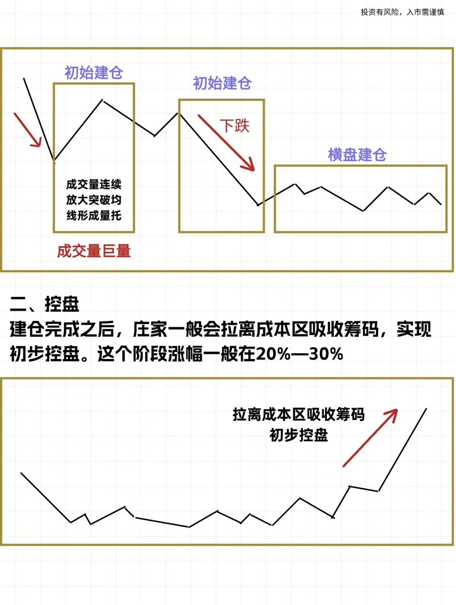
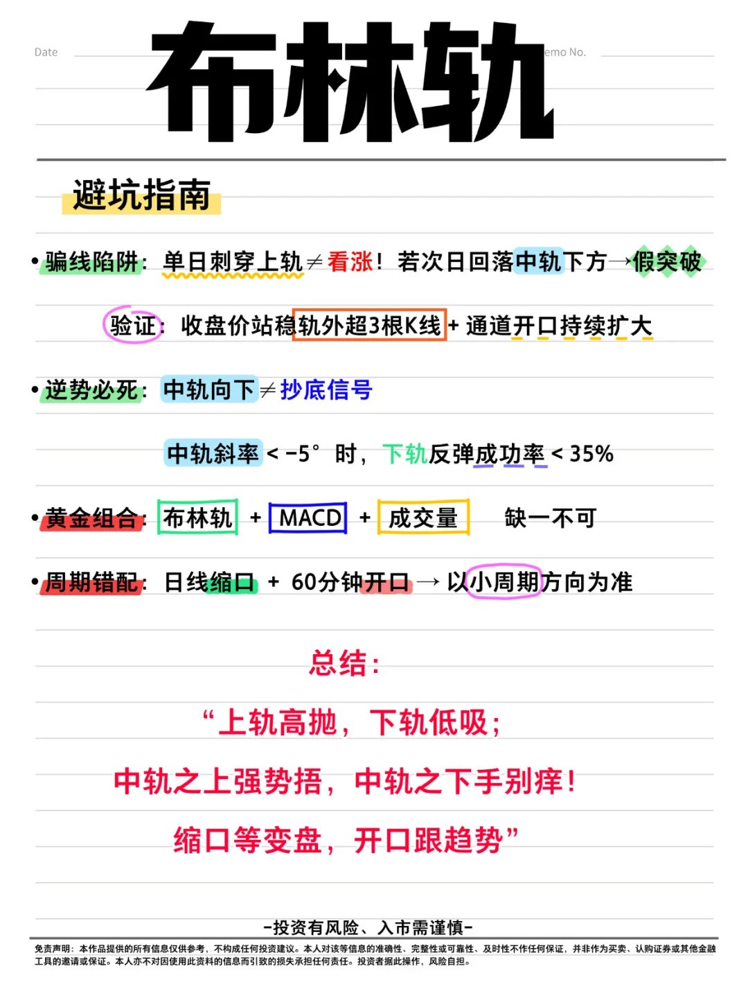

## 一、**保护本金最重要**

- 亏损10%，需要涨11%回本；
- 亏损20%，需要涨25%回本；
- 亏损30%，需要涨42.86%回本；
- 亏损40%，需要涨66.67%回本；
- 亏损50%，需要涨100%回本；
- 亏损60%，需要涨150%回本；
- 亏损70%，需要涨233.33%回本；
- 亏损80%，需要涨400%回本；
- 亏损90%，需要涨900%回本

## 二、**交易纪律提醒**

    建立正确的交易习惯, 保持冷静的头脑, 让每一次交易都成为成功基石

*   **时刻冷静**
    保持情绪稳定，不受市场波动影响

*   **耐心等待**
    等待最佳交易机会，不急于入场

*   **禁止埋单**
    不要在亏损位置继续加仓

*   **严格止损**
    设置并遵守止损点位，保护资金

*   **顺势而为**
    顺应市场趋势，不要逆势交易

*   **控制仓位**
    合理分配资金，避免过度风险

*   **利润奔跑**
    让盈利持续增长，不过早获利了结

*   **持续学习**
    不断学习和提升交易技能

*   **独立思考**
    形成自己的交易观点，不盲从他人

*   **保持纪律**
    严格遵守交易计划和规则

## 三、**复利**

$$1.01^{365} = 37.8$$
$$0.99^{365} = 0.03$$

## 四、散户要想赚到钱的必要条件

散户要想在股市里每年都能稳定赚到钱，必须要做到的几个条件，缺一不可，做不到，别说稳定，想要赚钱，几乎是难如登天。

​第一，小资金不要分票操作，特别是十万以内的，明面上你是分低了风险，但实际上你却失去了赚大钱的机会。10万以内就做一个，50万以内就做两个，怕风险就不要进股市。
​
第二，一定要分仓操作，没有散户知道股票的短期波动，哪怕你觉得某个区域是安全的，也要分仓布局，这样就能让你规避短期不确定的风险。
​
第三，一定要做埋伏，不要去追短期波动的价差，只有着急赚钱的人才会那样做，但都知道的，越是这样，越容易亏损。一定要做埋伏，在无人问津处埋伏，远离放量区域埋伏，离得越远越安全。
​
第四，不要有太大的时间观念，时间观念越重的人，就越是想要在短期里赚到钱，但现实早就证明，越是在意一周，一个月，能赚多少钱的人，都是亏损的主力军。你就重仓拿一个票，不要乱动，哪怕一年给你带来二十个点，你都是市场上的佼佼者。但却没有几个人能看得上一年二十个点的利润，因为都喜欢幻想，幻想某个阶段能抓几个板，就算真给你抓到了，那又怎样，问问自己，这样的模式稳定吗？

​就这几点，基本上每年都能赚到钱的人，是缺不了这几点的。然后再问问自己，你能做到吗？？

如果做不到，又整天幻想着在股市里赚钱，凭什么？？

也可以对我说的话不屑一顾，没关系，毕竟谁都有自己的想法，但记住了，市场从不会可怜一个整天在股市里犯错的人，市场是没有人的喜怒哀乐的，它就像一个公平的判官，你在市场里做对事，就会得到市场的奖励。你要是在市场里做错事，也同样会得到市场的惩罚，而绝大多数人，都在被市场惩罚着

## 四、为什么大家热爱交易市场

交易市场充满了未知，为什么还有很多人喜欢甚至是热爱这个行业？
因为对于普通人来说，交易这是财富最近得地方。并且交易的难度没有随着经济增长的衰退、阶级的固化而加剧。并且，BTC就是现阶段最大的红利！

十年前、二十年前、五十年前，交易就是这么难，现在依然是这么难，而这个社会上其他绝大多数的行业，都随着近年经济的不景气而下行，行业起起伏伏，各领风骚三五年，太多行业都已经以历史中消失了，对普通人来说，大数行业赚钱比以前难太多了。

按说现在有了高性能电脑，有了 AI 大模型，大家只需要卷算力，卷人才就行了，机构早就应该把普通人杀的片甲不留，一统江湖了吧？还真没有，即便上最强的计算机，最优秀的数学、计算机博士，机构一样没有挣钱更容易，没有多几个点的利润。

换到别的行业，这是不可想象的。

而交易的难度相对稳定，无论是关系户还是普通人都是一视同仁的难，按说经济形势好，赚钱容易的时候，交易赚钱能容易点吧？还真不是，不管经济形势好还是不好，交易都是平等的、一视同仁的难。

甚至对资金量相对大的机构来说，难度比个人还要大很多，很多个人能够采用的策略机构反而不能用，对普通人来说，这反而是社会少见的公平。

别的行业，你连和关系户竞争的资格都没有，——BTC就是现阶段最大的红利！

## 五、**庄家坐庄全过程笔记**

庄家的坐庄通常分为以下**五个主要步骤**：
1.  **建仓 (Accumulation)**
2.  **控盘 (Control)**
3.  **洗盘与试盘 (Washout & Testing)**
4.  **拉升 (Pumping)**
5.  **出货 (Distribution)**

### **1. 建仓 (Accumulation)**

*   **目标：** 在低位吸筹，获取大量廉价筹码，迫使散户出局。
*   **特征及操作：**
    *   **初步建仓：** 股价在下跌中放量上涨（量价齐升），突破均线。
    *   **打压建仓：** 通过放量下跌，打压股价，进一步吸筹。
    *   **横盘建仓：** 股价进入横盘震荡区间，持续吸筹。
*   **关键信号：** 在下跌过程中出现连续放大的成交量，且形成“量托”形态（成交量巨量）。
*   **最终结果：** 庄家积累了足够多的筹码。

### **2. 控盘 (Control)**

*   **目标：** 拉升股价脱离建仓成本区，进一步收集零散筹码，达到对股票的初步控制。
*   **特征及操作：**
    *   建仓完成后，股价开始温和上涨。
    *   庄家会推动股价**拉离成本区**，吸收浮动筹码。
*   **涨幅：** 通常在这个阶段，涨幅在 **20%—30%**。

### **3. 洗盘和试盘 (Washout & Testing)**

*   **目标：** 
    *   **洗盘：** 震出不坚定的散户，减轻后期拉升阻力。
    *   **试盘：** 测试市场对该股票的关注度和活跃度。
*   **特征及操作：**
    *   **洗盘：** 庄家进行“砸盘”，股价量价齐跌（通常在控盘后的高点）。
    *   **试盘：** 庄家再度进场，拉出“天量大阳线”，吸引散户进场，测试市场反应。
    *   **完成试盘后：** 股价会再次下跌，但通常跌幅有限。

### **4. 拉升 (Pumping)**

*   **目标：** 将股价大幅推高，实现做庄的利润主要来源。
*   **特征及操作：**
    *   试盘后的下跌时间通常很短。
    *   股价开始**温和放量上涨**。
    *   随后演变为**急剧放大量，股价快速大涨**。
*   **特点：** 这是所谓的“**主升浪行情**”，也是庄家利润最大的阶段。

### **5. 出货 (Distribution)**

*   **目标：** 在高位将手中筹码分批卖出给散户，实现盈利并离场。
*   **特征及操作：**
    *   股价**上涨动能衰竭**，可能出现滞涨、高位震荡或缓慢下跌。
    *   庄家采取多种方式诱使散户接盘：
        *   **维持出货**
        *   **诱多出货** (制造上涨假象)
        *   **拉头部出货** (在高点附近边拉边出)
        *   **拉底部出货** (下跌后小幅反弹再出)
*   **最终：** 彻底出货，庄家离场。
*   **此阶段庄家目标：** 想方设法让散户买入。

---

### **整体流程示意图概览 (Simplified)**

整个过程是一个循环，通常按照以下大致顺序进行：

1.  **准备 / 建仓** (低位吸筹，震荡向下，让散户出)
2.  **试盘 / 整理** (尝试拉升，然后回落)
3.  **初步拉升** (股价脱离成本区)
4.  **洗盘** (震仓，洗出浮筹)
5.  **拉升** (主升浪，快速上涨)
6.  **再次洗盘**
7.  **再次拉升**
8.  **反弹 / 砸盘**
9.  **出货** (在高位派发筹码，让散户接盘)

---

